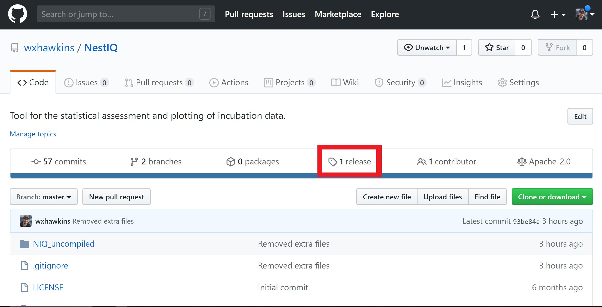
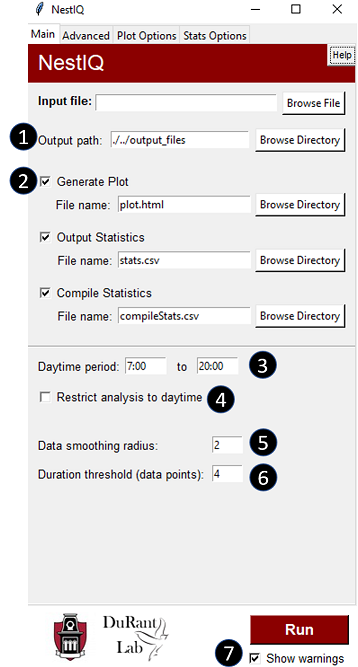

# NestIQ Tutorial/Manual

## Getting Started

Navigate to the "release" tab on the NestIQ GitHub page (https://github.com/wxhawkins/NestIQ/releases). Select the most recent release and download the ".zip" file. Unzip the directory and click "Launch NestIQ.bat". This batch file simply points to the "NestIQ.exe" executable file found within the "dist" directory; alternative, NestIQ can be launched directly from this file.

## Introduction

The **NestIQ** user interface has five tabs which can be selected at the top of the window.  The "Main" tab contains all settings and inputs *required* to execute the program but allows only limited parameter configuration.  More precise parameter configuration is possible from the "Advanced" tab where you can utilize NestIQ's machine learning algorithms, load configuration files, or update model parameters directly. The "Plot Options" and "Stats Options" tabs allow for customization of the composition and appearance of NestIQ's plot and statistics files, respectively.  Lastly, the "Edit" tab allows for the modification of NestIQ outputs.

***

### Main Tab

1. Path to directory where NestIQ output files will be saved. Note that "./" represents the directory housing NestIQ.exe and "../" means go back one directory.
2. The status of these three check boxes dictates what files are generated upon running the analysis.
3. The times given here dictate the period of time considered by the program to be "daytime". This influences day and night-specific statistics, position of day markers on the plot, and more. 
4. Checking this option restricts NestIQ's analysis to the daytime period specified in "3". This time range does not necessarily have to represent daytime. The user can enter any time range they wish to limit the analysis to. Just be mindful of the terminology; for instance the *mean daytime egg temperature* statistic will be referring to the time range provided in "3" irrespective of the actual time of day represented.
5. Smoothing radius is the number of data points included when the program calculates the rolling mean for input temperatures; i.e. a smoothing radius of one causes the averaging of data points i-1, i, and i+1. Entering 0 here disables the rolling mean, causing the program to look at individual temperatures as they are. As this number increases, a wider range of temperatures are averaged during analysis resulting in a smoothing effect that can help minimize the effect of minor fluctuations in temperature. In the Plot Options tab, you can dictate whether the raw or smoothed data is used for plotting.
6. Entering a value greater than 1 here causes the program to discard any bouts it detects below the set duration threshold. Note that duration is measured as number of data points not raw time.
7. Clicking the run button executes the program. This can also be triggered by hitting "enter" on the keyboard. Unchecking the "Show warnings" checkbox suppress all messages other than critical errors and file override requests.

### Input Data

At the top of the "Main" tab, you will find the input file entry box where you provide your file containing the incubation data to be analyzed. The input file should be a comma separated value (CSV) file with the data in the format: data point, date (MM/DD/YYYY) and time (HH:MM), egg temperature, and optionally, ambient temperature (example shown below). Excel files can be saved as CSV's by going to "Save As", clicking the drop-down menu below the file name entry box, and selecting CSV. 

Example input file:

The data point column simply provides an index number to reference each line in the input file. The starting number of the data point column does not matter; however, the numbers in this column should be continuous and sequential. 24hr time format should be used in the data/time column. As mentioned, the air temperature column is optional. If provided, this column allows air temperature to be plotted and air temperature-specific statistics to be provided in the statistics file. Header lines like the one present in the example are also optional. Upon execution, the program performs a thorough check of the input and tries to provide a descriptive warning/error message if a problem is discovered. If NestIQ is unable to identify the specific problem with your file, make sure there are no "extra" cells in the file such as columns after the ambient/air temperature column. NestIQ supports processing of multiple input files simultaneously; simply click the browse file option next to the input file box, select multiple files (with shift-click for instance), and run normally.

***

### Output Options

1. Generate Plot
   * Output HTML file with interactive plot showing predicted on and off-bouts plotted over input data points.
2. Output Statistics
   * Output CSV file containing information about each individual bouts, individual days, and the input file as a whole.
3. Compile Statistics
   * If multiple input files are selected, the statistical summaries from the above "Output statistics" option are compiled into a single file and a set of statistics spanning all provided data sets is provided.  This is useful for comparing related groups of input files such as for various treatments.

For each of these options, clicking the checkbox reveals an entry box in which you enter the name you wish to give the file being created (or appended to in the case of the third option).

Example plot:

1. Day markers delimit 24 hr periods starting at the user provided day start time.
2. Egg temperatures are plotted here but egg minus air temperatures can be plotted in place of or with egg temperatures (via the Plot Options tab).
3. Various functions for working with the plot can be selected from the toolbar on the right.

Individual data points provided in the input file are plotted as dots with colors corresponding to assigned incubation state (on or off-bout). Extensive plot configurability is possible with the Plot Options tab: font sizes, presence of plot elements, plot element colors, plot element sizes, legend location, etc.

***

### Unsupervised Learning

If the "Run unsup. learning by default" option on the Advanced tab is selected (as it is by default upon downloading NestIQ), the user can simply provide an input file and click **Run**.  NestIQ's unsupervised machine learning algorithm will be automatically applied to determine model parameters for the data provided. Unsupervised learning can also be run without executing full file processing by clicking the **Unsupervised Learning** button on the Advanced tab. With unsupervised learning, it is often helpful to play with the smoothing radius and duration threshold parameters on the Main tab. Try different values for the smoothing radius and see if better results are obtained; it is difficult to predict an ideal value for this parameter without some manual experimentation. Unsupervised learning often results in the annotation of minor temperature fluctuations as incubation bouts. Setting a duration threshold is helpful in combating this effect.

***

### Supervised Parameter Acquisition

Provide an input file in the Main tab and then on the Advanced tab click **Select Vertices**. This will generate a plot similar to the one below. For a subset of the plot, click where you believe incubation is beginning and terminating. The amount of vertices to place will depend on your data; you want to place enough to capture the general trend of incubation behavior. Along these lines, if there is an obvious difference in daytime and nighttime behavior, the points you place should include daytime and nighttime data. Placing points for one full day of data will be plenty for most data files assuming behavior does not change drastically day to day. The data you choose to annotate should be contiguous; do not skip around the plot. Once you are satisfied with your selections save the plot as an HTML file with Ctrl+s. Finally, go back to the NestIQ Advanced tab and provide this saved HTML file in the **Vertex File** box using the **Browse File** feature, and click the **Supervised Learning** button. You will then see the model parameters updated.

1. Red dots were manually placed at apparent on-bout/off-bout and off-bout/on-bout transitions (vertices).
2. For vertex selection plots, if a valid ambient/air temperature column is present in the input file, egg temperatures minus ambient temperatures will be plotted as this allows for more accurate determination of animal-dependent temperature changes. Air temperatures can be hidden by clicking on the corresponding item on the legend.
3. The **Point Draw Tool** must be selected in order to place vertices. It will be selected by default but will be disabled if a different tool, such as box zoom, is selected.

***

### Model Parameters

The initial probabilities play a major, although not absolute role in determining if the first annotation is on-bout or off-bout. Modify these values if you believe the algorithm is incorrectly labeling the first bout of your input file.

Transition probabilities dictate the frequency of transitioning from one bout state to another. The table for this section should be read as *transition from row label to column label*; e.g. the top right box shows the probability of transitioning from an off-bout to an on-bout. If you believe the algorithm is too quick to change state, in other words, it is marking what you see as minor fluctuations as true bouts, try decreasing the probabilities for on-bout to off-bout and/or off-bout to on-bout.

Temperature change distribution parameters are perhaps the least intuitive. Data points are labeled on-bout or off-bout primarily based on the temperature change from the previous point. For a given state, the mean tells the algorithm what to expect the average temperature change  to be and how variable this value is (standard deviation). These values should be changed if you feel the annotations are leaning too heavily toward on-bouts or too heavily toward off-bouts. If it is leaning too heavily toward on-bouts, try increasing the on-bout mean value and/or the off-bout mean value; this will shift the balance farther toward off-bouts. Do the opposite to mitigate an off-bout bias.

***

### Configuration Files

Frequently used settings profiles can be saved as configuration (config) files using the **Save Config** option at the top of the Advanced tab. Configuration profiles can then be loaded into NestIQ at a later time using the **Load Config** option. You can also select **Set as Default** to have the current settings profile loaded into NestIQ automatically upon opening. Some example configuration files for various birds are provided in the config_files folder.

***

### Supplemental

| Option/Abbreviation  | Meaning                                                      |
| -------------------- | :----------------------------------------------------------- |
| StDev                | Standard deviation                                           |
| (D)                  | This statistic was calculated only from data within the daytime period starting on this date |
| (N)                  | This statistic was calculated only from data within the nighttime period starting on this date |
| (DN)                 | This statistic was calculated from both the daytime and nighttime periods starting on this date (full 24 hr period) |
| Adjusted temperature | Egg temperature minus ambient temperature                    |
