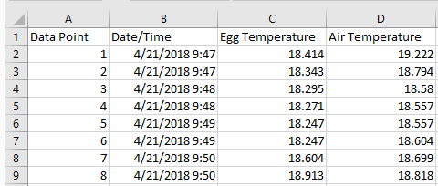

# NestIQ Tutorial/Manual

## Getting Started

Navigate to the **Releases** tab on the NestIQ GitHub page (https://github.com/wxhawkins/NestIQ/releases). Select the most recent release, and download the ".zip" file. Unzip the directory and click "Launch NestIQ.bat". This batch file simply points to the "NestIQ.exe" file found within the "dist" directory; alternative, NestIQ can be launched directly from this file.

## Introduction

The NestIQ user interface has four tabs which can be selected at the top of the window.  The **Main** tab contains all settings and inputs *required* to execute the program but allows only limited parameter configuration.  More precise parameter configuration is possible from the **Advanced** tab where you can leverage NestIQ's machine learning algorithms, load configuration files or update model parameters manually. The **Plot Options** and **Stats Options** tabs allow for customization of the composition and appearance of NestIQ's plot and statistics files, respectively. Clicking the **Run** button executes the program. This can also be triggered by hitting enter/return on the keyboard. Unchecking the **Show warnings** checkbox suppresses all non-critical messages (not recommended for new users).

***

## Main Tab

#### Input Data

At the top of the **Main** tab, you will find the input file entry box where you provide your file containing the incubation data to be analyzed. Normally, the input file should be a comma separated value (CSV) file with the data in the format: data point, date/time, egg temperature and, optionally, ambient temperature (example shown below). Excel files can be saved as CSV's by going to **Save as**, clicking the drop-down menu below the file name entry box, and selecting CSV. The exception to this type of input is when the user wishes to edit the output of NestIQ. This is further discussed in the "Editing" section below.

The data point column simply provides an index number to reference each line in the input file. The data point column does *not* have to begin with one; however, the numbers in this column should be continuous integer values. 24 hr time format should be used in the data/time column. Accepted date/time formats are:

* MM/DD/YYYY HH:MM:SS
* MM/DD/YYYY HH:MM
* MM/DD/YY HH:MM:SS
* MM/DD/YY HH:MM

Of note, seconds values are inferred if multiple rows share the same date/time value. For instance, in the example input file provided, each minute (e.g. 4/21/2018 9:48) appears in two rows. NestIQ infers from this that measurements were taken every 30 seconds and this is reflected in statistical output. As mentioned, the air temperature column is optional. If provided, this column allows air temperature to be plotted and air temperature-specific statistics to be provided. Header lines like the one present in the example are also optional. Upon execution, the program performs a thorough check of the input and tries to provide descriptive warning/error messages if problems are discovered. If NestIQ is unable to identify the specific problem with your file, make sure there are no "extra" cells in the file such as columns after the ambient/air temperature column. NestIQ supports processing of multiple input files simultaneously; simply click the browse file option next to the input file box, select multiple files (with shift-click, for instance) and run normally.

#### Output Options

1. Generate Plot
   * Output HTML file with interactive plot showing predicted on and off-bouts plotted over input data points.
2. Output Statistics
   * Output CSV file containing information about each individual bouts, individual days, and the input file as a whole. 
3. Compile Statistics
   * If multiple input files are selected, the statistical summaries from the above **Output Statistics** option are compiled into a single file, and a set of statistics spanning all provided input files is provided.  This is useful for comparing related groups of input files such as for a data sets from a common treatment group.

For dictating the path of output files, the **Save as** buttons can be used. Alternatively, you can simply type a file name in the corresponding entry box. NestIQ will automatically add the appropriate file extension and save the file to the "output_files" directory within the NestIQ parent directory.

1. Day markers are placed at the first data point for each date represented in the input file (every 24 hrs).
2. Egg temperatures are plotted here, but egg minus air temperatures can be plotted in place of or with egg temperatures (via the **Plot Options** tab).
3. Various functions for working with the plot can be selected from the toolbar on the right.

Individual data points provided in the input file are plotted as dots with colors corresponding to assigned incubation state (on or off-bout). Extensive plot configurability is possible with the **Plot Options** tab: font sizes, presence of plot elements, plot element colors, plot element sizes, legend location, etc.

#### Editing

If you wish to alter the vertex (on/off-bout) placement of NestIQ, select **Edit mode** and select **Run**. So long as **Generate Plot** is selected, this creates a version of the plot that can be modified using the **Point Draw Tool** which can be selected on the toolbar to the right side of the plot. With this tool selected, you can place new vertices by clicking, move vertices by clicking and dragging and remove vertices by click-selecting and pressing backspace. Once you are done making changes, save the plot with ctrl+s and provide this HTML plot as an input file for NestIQ. Instead of calculating bout positions as it normally would with a CSV input file, the program will extract the vertex locations from your plot and use these for statistical calculations and the creation of new plots. Note that some browsers may save the HTML plot in a way that NestIQ cannot read. If NestIQ alerts you that it cannot detect any vertices in the edited plot, try using a different browser such as Google Chrome or Microsoft Edge.

#### Other Main Tab Parameters

**Daytime period**: Provide times in 24 hr format to dictate the boundaries of what is considered daytime. This has several implications for the statistics reported by NestIQ as it determines how data is categorized as daytime or nighttime. Checking **Restrict analysis to daytime** causes NestIQ to not assign bouts to data residing outside of the daytime boundaries. This is helpful whenever you wish to restrict the analysis to a certain time of day. Although termed "daytime", this mechanic can be used to restrict the analysis to *any* time period the user wishes. Just be mindful of the terminology; for instance the *mean daytime egg temperature* statistic will be referring to the time range you provided irrespective of the actual time of day represented.

**Data smoothing radius**: This determines the width of the rolling mean used by NestIQ for calculations. For example, a value of one indicates that NestIQ will take the average of the temperatures at data point i - 1, i and i + 1 whenever a temperature value is required for a calculation. A value of zero would indicate that no rolling mean is applied. In the **Plot Options** tab, you can dictate whether the raw or smoothed data is used for plotting.

**Duration threshold**: This threshold determines the minimum number of data points a bout must be composed of in order to be considered significant. After initial bout assignment, NestIQ discards any bouts not meeting this minimum number of data points.

## Advanced Tab

### Unsupervised Learning

If algorithm parameters on the **Advanced** tab are blank, NestIQ's unsupervised machine learning algorithm will be automatically executed to determine some baseline model parameters for the data provided. Unsupervised learning can also be run at any time by clicking the **Unsupervised Learning** button on the **Advanced** tab given an input file is supplied on the **Main** tab. With unsupervised learning, it is often helpful to play with the smoothing radius and duration threshold parameters on the **Main** tab. Unsupervised learning often results in the annotation of minor temperature fluctuations as incubation bouts. Setting a duration threshold is helpful in combating this effect. In general, unsupervised learning if for quick and dirty analysis. For more accurate results, supervised learning should be used.

***
### Supervised Learning

For this workflow, provide an input file in the **Main** tab and then click **Select Vertices** on the **Advanced** tab. This will generate a plot similar to the one below. Select the **Point Draw Tool** from the toolbar on the right. Then, for a subset of the plot, click where you believe incubation is beginning and terminating. Note that clicking and dragging can be used to move existing vertices, and pressing backspace after selecting a vertex can be used to delete it. The amount of vertices to place will depend on your data; you want to place enough to capture the general trend of incubation behavior. Along these lines, if there is an obvious difference in daytime and nighttime behavior, the points you place should include daytime and nighttime data. Placing points for one full day of data will be plenty for most data files assuming behavior does not change drastically day to day. The data you choose to annotate should be contiguous -- do not skip around the plot. Once you are satisfied with your selections save the plot as an HTML file with ctrl+s. Finally, go back to the NestIQ **Advanced** tab and provide this saved HTML file in the **Vertex File** box using the **Browse File** feature and click the **Supervised Learning** button. You will then see the model parameters update. If NestIQ states it cannot detect any vertices in the provided file, try using a different browser such as Google Chrome or Microsoft Edge.

1. Red dots were manually placed at apparent on-bout/off-bout and off-bout/on-bout transitions (vertices).
2. Supervised learning can be performed using egg temperature readings or adjusted temperature (egg - air) depending on user preference. If you think adjusted temperature allows for easier identification of on and off-bouts, select **Egg - Air** under **Plot data** on the **Plot Options** tab. Then mark your vertices as described above and select **Train from adjusted temperature** on the **Advanced** tab before clicking the **Supervised Learning** button.
3. The **Point Draw Tool** must be selected in order to place vertices. It will be selected by default but will be disabled if a different tool, such as box zoom, is selected.

***
### Model Parameters

The initial probabilities play a major, although not absolute role in determining if the first annotation is on-bout or off-bout. Modify these values if you believe the algorithm is incorrectly labeling the first bout of your input file.

Transition probabilities dictate the frequency of transitioning from one bout state to another. The table for this section should be read as *transition from row label to column label*; e.g. the top right box shows the probability of transitioning from an off-bout to an on-bout. If you believe the algorithm is too quick to change state, in other words, it is marking what you see as minor fluctuations as true bouts, try decreasing the probabilities for on-bout to off-bout and/or off-bout to on-bout transitions.

Temperature change distribution parameters are perhaps the least intuitive. Data points are labeled on-bout or off-bout primarily based on the temperature change from the previous point. For a given state, the mean tells the algorithm what to expect the average temperature change  to be and how variable this value is (standard deviation). These values should be changed if you feel the annotations are leaning too heavily toward on-bouts or too heavily toward off-bouts. If it is leaning too heavily toward on-bouts, try increasing the on-bout mean value and/or the off-bout mean value; this will shift the balance farther toward off-bouts. Do the opposite to mitigate an off-bout bias.

***
### Configuration Files

Frequently used settings profiles can be saved as configuration (config) files using the **Save Config** option at the top of the **Advanced** tab. Configuration profiles can then be loaded into NestIQ at a later time using the **Load Config** option. You can also select **Set as Default** to have the current settings profile loaded into NestIQ automatically upon opening. Some example configuration files for various birds are provided in the "config_files" folder.

***
## Supplemental

| Option/Abbreviation    | Meaning       |
| ---------------------  | :------------------------------------------------------------- |
| StDev                 | Standard deviation  |
| (D)                   | This statistic was calculated only from data within the user-defined "daytime" |
| (N)                   | This statistic was calculated only from data within the user-defined "nighttime" |
| (DN)                  | This statistic was calculated from daytime and nighttime data (full 24 hr period) |
| Adjusted temperature | Egg temperature minus ambient temperature |
